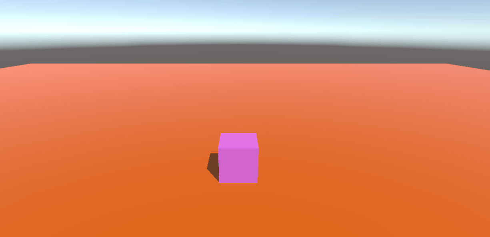
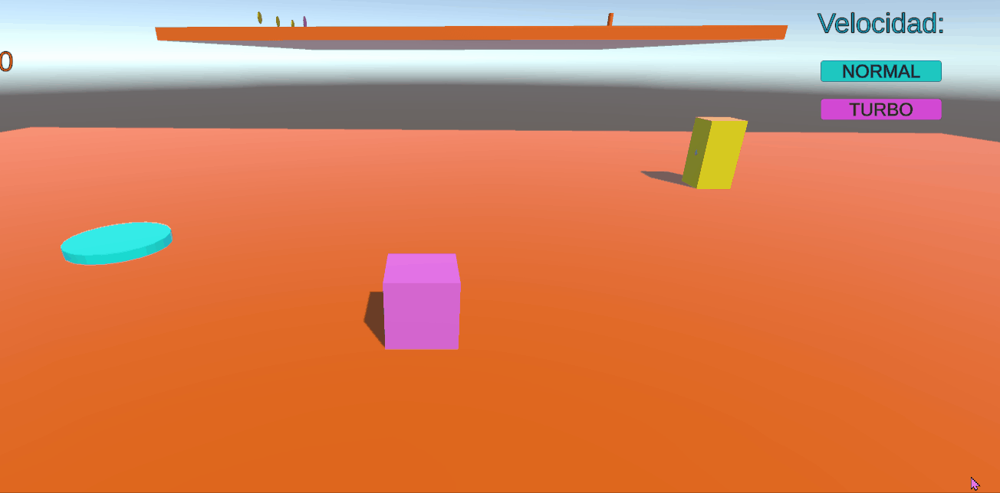
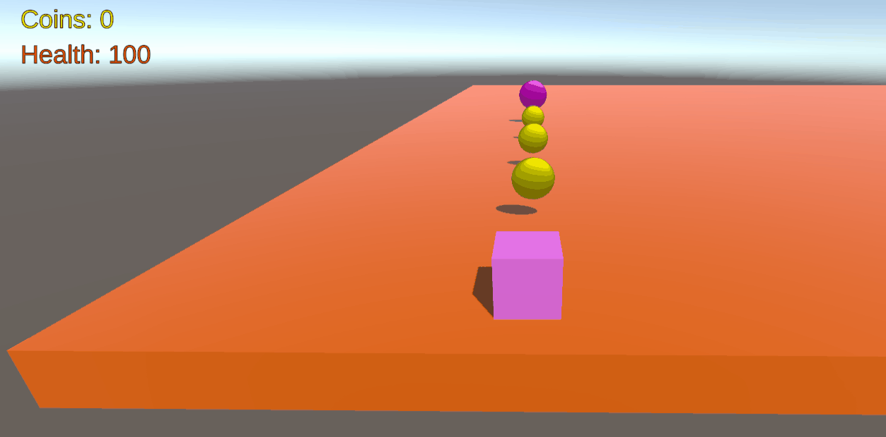
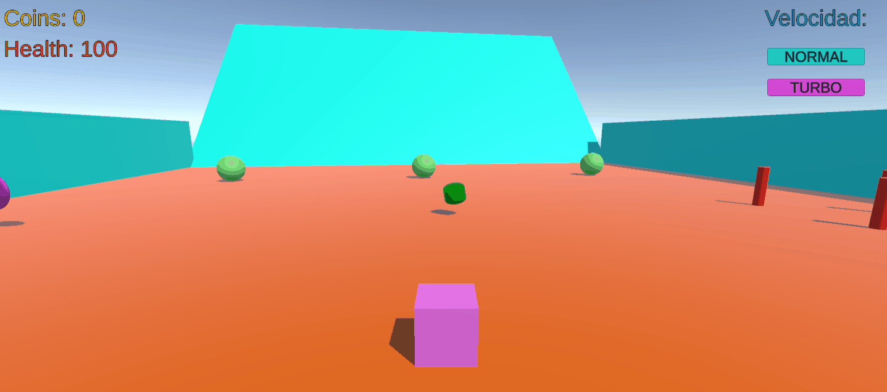
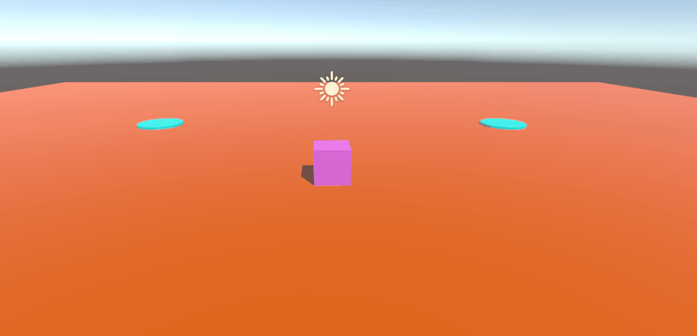
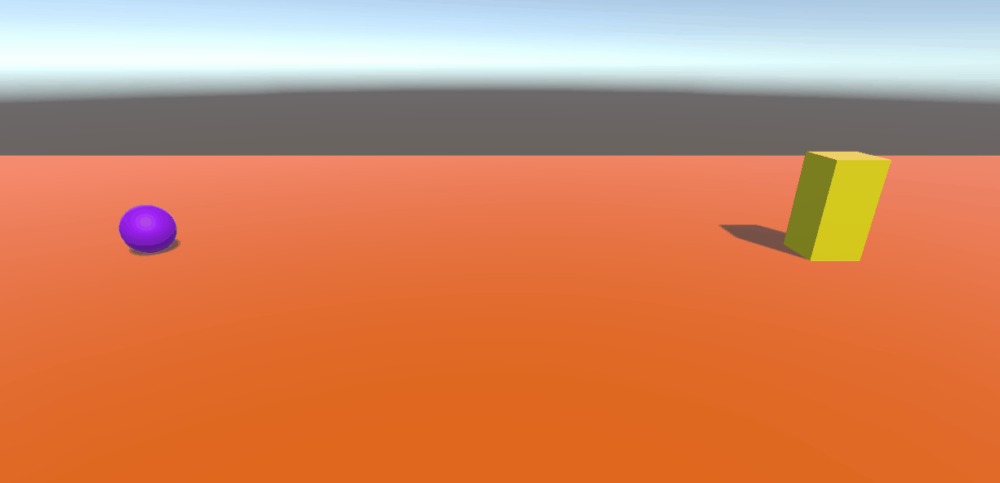
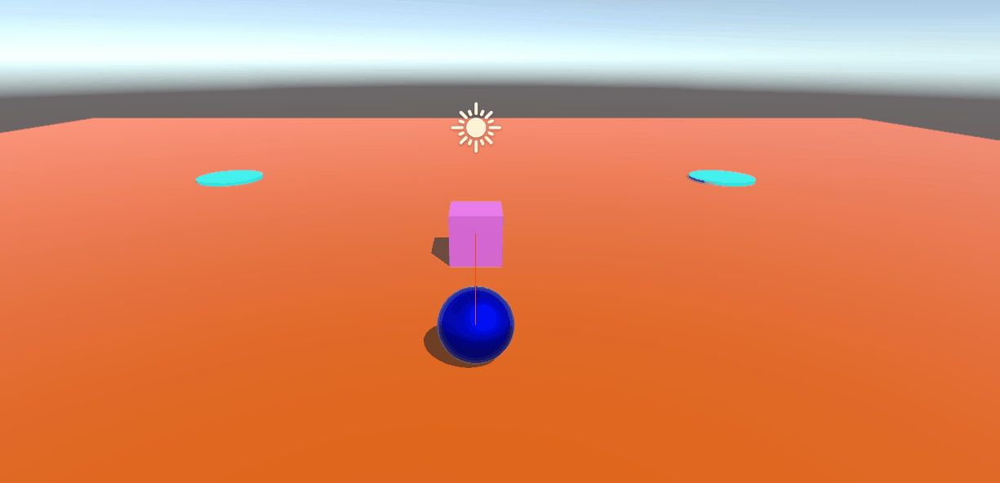

# Eventos-y-Movimiento-rectilineo

## 1 Crear un script para mover al objeto jugador con los ejes Horizontal y Vertical

-> Haciendo uso del Input.GetAxis('Vertical') y Input.GetAxis('Horizontal') podemos hacer que el jugador se mueva hacia adelante y hacia atras o que rote sobre si mismo y cambie la dirección a la que se mueve.

(Scripts utilizados: PlayerController.cs)

## 2 Implementar una UI que permita configurar con qué velocidad te moverás: turbo o normal. También debe mostar la cantidad de objetos recolectados y si chocas con alguno especial restar fuerza.

### Velocidad Turbo o Normal con botones de la UI:

-> PlayerController.cs posee 2 variables que guarda la velocidad normal y la velocidad en modo turbo y contiene 2 funciones que cambia la velocidad a una de las dos. Despues para cada botón, podemos llamar a estas funciones para que se modifique la velocidad del jugador:

(Scripts utilizados: PlayerController.cs)

### Recolectar monedas y actualizar la UI:

-> Las monedas poseen un evento OnTriggerEnter para detectar si el jugador ha entrado en su collider, y poder llamar al gameManager.cs para cambiar el valor de las monedas en la interfaz.

(Scripts utilizados: Coin.cs, GameManager.cs)

### Recibir daño y reducir tu Vida / Fuerza en la UI:

-> Al chocar con los cilindros rojos se activa el evento OnCollisionEnter lo cual llama al gameManager para quitarle Vida / Fuerza al jugador y actualizar el texto de la interfaz, aparte se le añade una fuerza de repulsión al jugador para alejarlo del cilindro.

(Scripts utilizados: Danger.cs, GameManager.cs)

## 3 Agregar a tu escena un objeto que al ser recolectado por el jugador haga que otro objetos obstáculos se desplacen de su trayectoria.

-> El objeto que recolecta el jugador contiene referencias a otros 3 objetos (Esferas Verdes) para que cuando se active, se le añadan una fuerza y se choquen contra la pared.

(Scripts utilizados: Recolect.cs)

## 4 Agrega un objeto que te teletransporte a otra zona de la escena.

-> Hay dos objetos con el Script teleporter.cs el cual contiene una referencia el uno del otro (El teletransportador A tiene una referencia del B y vicecersa), cuando el jugador entra en su collider, se le cambia la posición hasta el otro teletransportador.
Para evitar que el jugador cambie su posición constantemente, se activa una etiqueta que evita que este se pueda volver a teletransportar hasta que salga del colider (OnTriggerExit).

(Scripts utilizados: teleporter.cs)

## 5 Agrega un personaje que se dirija hacia un objetivo estático en la escena.

-> Restando la posición del objetivo con la posición del objeto a mover, podemos calcular el vector entre estos dos y moverlo en esa dirección.

(Scripts utilizados: Follow.cs)

# 6  Agrega un personaje que siga el movimiento del jugador 

-> Añadimos la posibilidad del jugador de moverse por el escenario y establecemos otro objeto cuyo objetivo es el propio jugador al moverse. De esta forma podemos simular que el objeto nos sigue.

(Scripts utilizados: Follow.cs)

